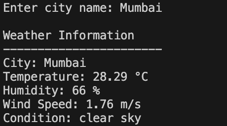

5"}
# 🌦️ Python Weather App

This is a simple Python project that shows real-time weather information for any city using the OpenWeather API.

## Features
- Get current weather of any city
- Shows temperature, humidity and wind speed
- Simple command line application

## Technologies Used
- Python
- Requests Library
- OpenWeather API

## How to Run

1. Clone the repository

git clone https://github.com/sachinkamti7857/weather-app-python

2. Install requirements

pip install -r requirements.txt

3. Run the program

python weather.py

## Screenshot

Weather App Screenshot

## Author
Sachin Kamti
